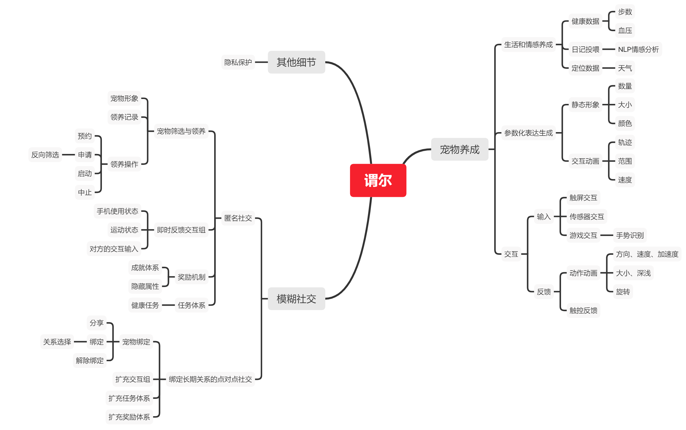
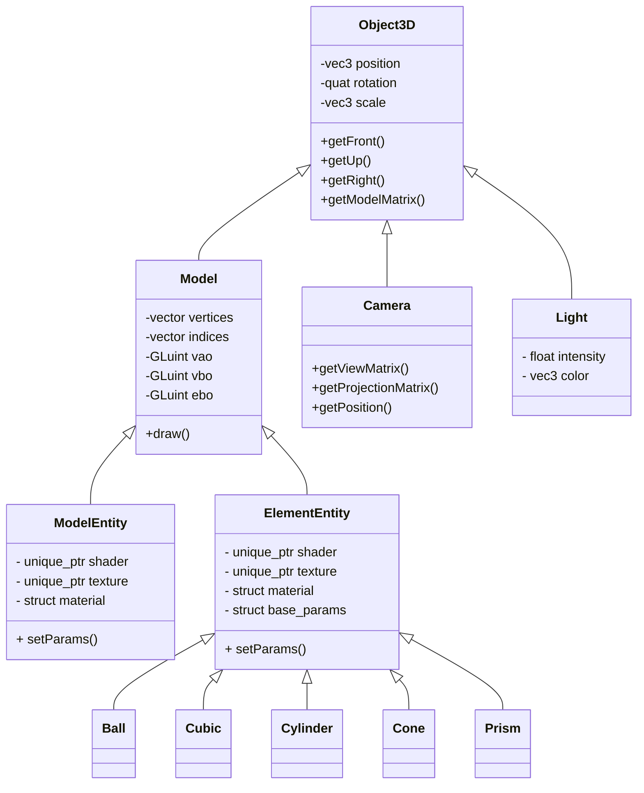

<div class="cover" style="page-break-after:always;font-family:方正公文仿宋;width:100%;height:100%;border:none;margin: 0 auto;text-align:center;">
    <div style="width:60%;margin: 0 auto;height:0;padding-bottom:10%;">
        </br>
        
    </div>
    </br></br></br></br></br>
    <div style="width:60%;margin: 0 auto;height:0;padding-bottom:40%;">
        
	</div>
    </br></br></br></br></br></br></br></br>
    <span style="font-family:华文黑体Bold;text-align:center;font-size:20pt;margin: 10pt auto;line-height:30pt;">《谓尔智能宠物养成APP》</span>
    <p style="text-align:center;font-size:14pt;margin: 0 auto">CG Project </p>
    </br>
    </br>
    <table style="border:none;text-align:center;width:72%;font-family:仿宋;font-size:14px; margin: 0 auto;">
    <tbody style="font-family:方正公文仿宋;font-size:12pt;">
    	<tr style="font-weight:normal;"> 
    		<td style="width:20%;text-align:right;">题　　目</td>
    		<td style="width:2%">：</td> 
    		<td style="width:40%;font-weight:normal;border-bottom: 1px solid;text-align:center;font-family:华文仿宋"> 基于OpenGL框架的智能宠物渲染和游戏机制构建</td>     </tr>
    	<tr style="font-weight:normal;"> 
    		<td style="width:20%;text-align:right;">上课时间</td>
    		<td style="width:2%">：</td> 
    		<td style="width:40%;font-weight:normal;border-bottom: 1px solid;text-align:center;font-family:华文仿宋"> 周二11,12</td>     </tr>
    	<tr style="font-weight:normal;"> 
    		<td style="width:20%;text-align:right;">授课教师</td>
    		<td style="width:2%">：</td> 
    		<td style="width:40%;font-weight:normal;border-bottom: 1px solid;text-align:center;font-family:华文仿宋">唐敏 </td>     </tr>
    	<tr style="font-weight:normal;"> 
    		<td style="width:20%;text-align:right;">姓　　名</td>
    		<td style="width:2%">：</td> 
    		<td style="width:40%;font-weight:normal;border-bottom: 1px solid;text-align:center;font-family:华文仿宋"> 王振阳，李想，高伟渊，王喆</td>     </tr>
    	<tr style="font-weight:normal;"> 
    		<td style="width:20%;text-align:right;">学　　号</td>
    		<td style="width:2%">：</td> 
    		<td style="width:40%;font-weight:normal;border-bottom: 1px solid;text-align:center;font-family:华文仿宋">3190104758等 </td>     </tr>
    	<tr style="font-weight:normal;"> 
    		<td style="width:20%;text-align:right;">组　　别</td>
    		<td style="width:%">：</td> 
    		<td style="width:40%;font-weight:normal;border-bottom: 1px solid;text-align:center;font-family:华文仿宋"> 第十一组</td>     </tr>
    	<tr style="font-weight:normal;"> 
    		<td style="width:20%;text-align:right;">日　　期</td>
    		<td style="width:2%">：</td> 
    		<td style="width:40%;font-weight:normal;border-bottom: 1px solid;text-align:center;font-family:华文仿宋">2020.07.04</td>     </tr>
    </tbody>              
    </table>
</div>

<!-- 注释语句：导出PDF时会在这里分页 -->


# 谓尔智能宠物养成APP

<center><div style='height:2mm;'></div><div style="font-family:华文楷体;font-size:14pt;">第十一组（王振阳，李想，高伟渊，王喆）</div></center>
<center><span style="font-family:华文楷体;font-size:9pt;line-height:9mm">浙江大学计算机学院</span>
</center>
<div>
<div style="width:52px;float:left; font-family:方正公文黑体;">简　介：</div> 
<div style="overflow:hidden; font-family:华文楷体;">谓尔是在2021年开发的一款ios移动应用，通过交互和情感投入转化参数实现宠物养成，通过宠物开展社交，打造模糊社交新模态。
通过谓尔，你可以定制并长期培养自己的专属宠物，通过喂养日记，语音交互，提供定位和健康运动信息，甚至使用其他应用等信息让你的宠物逐渐成长，你的「一举一动」都会对宠物产生影响，使其作出反应，毛玻璃下富于变化的宠物形象满足你的情感需求。
同时，用户可以进入社交模式，在社区中随机浏览和临时领养他人宠物，通过观察和喂养宠物感受宠物主人的生活方式和性格情感，并在社交模式中完成任务解锁特殊成就，崭新的社交形式赋予模糊社交更多可能。
社交模式还支持点对点的宠物长期绑定机制，在绑定机制下，宠物有着更丰富的交互模式，以及允许进行跌倒检测、屏幕时间监控等以满足亲子家庭等关系的特殊需求。</div>
</div>
<div>
<div style="width:52px;float:left; font-family:方正公文黑体;">关键词：</div> 
<div style="overflow:hidden; font-family:华文楷体;">电子宠物；OpenGL；定制化；数字生成艺术</div>
</div>

## 谓尔的模块设计



​    可以看到，APP分为若干模块，本报告仅对其中的图形学模块进行详细的阐述。其中对于大作业要求的若干条目，APP和PC端小游戏满足了如下要求。

- 具有基本体素(立方体、球、柱体、锥体、多面棱柱、多面棱台）的建模表达能力;

- 具有基本三维网格导入导出功能（建议OBJ格式) ;
	- 需要了解OBJ格式，完成基本OBJ模型的读入和导出，不要求处理文件中的纹理和材质信息；
	
- 具有基本材质、纹理的显示和编辑能力;

- 具有基本几何变换功能(旋转、平移、缩放等)﹔

- 基本光照明模型要求，并实现基本的光源编辑（如调整光源的位置，光强等参数);

- 能对建模后场景进行漫游如Zoom In/Out, Pan, Orbit,Zoom To Fit等观察功能。

- 能够提供动画播放功能(多帧数据连续绘制)，能够提供屏幕截取/保存功能。
	- 多帧连续绘制指读取连续的 obj 文件(或其他格式的模型文件)，对其网格进行多次的绘制;简单的平移、旋转、缩放等不能视为动画播放。


​    此外，APP还实现了如下的Bonus：
- 基于可选择的 AABB 碰撞盒和 OBB 碰撞盒实现的实时碰撞检测；

- 多平台支持：在 `iOS`设备上基于 `OpenGL ES`框架实现了电子宠物的交互，在 `PC` 端支持 `Window`s ，`Linux`和 `OSX` 系统，基于 `cmakelist` 进行文件组织，实现了多平台的兼容；
	
- 基于核心的物理引擎，实现了较有难度的一类吃豆人游戏。
	
	

## 谓尔基本模块实现

### 类图



各个元素之间的继承派生关系如图。可以看到，在代码组织中，我们使用 `Entity` 抽象出单个元素，将所有的 `Shader`，`Texture`，`Material` 封装于其中。通过构造函数传递参数的方式指定元素需要的所有参数，并且在需要绘制的时候直接调用 `draw()`，抽象逻辑层次。对于元素进行改变完全由场景进行管理和计算。


### 场景管理

首先，场景的初始配置文件由一个 `json` 文件指定。`json` 文件的格式如下：

```json
{
    "skybox" : [
        "${leftImgPath}",
        "${rightImgPath}",
        "${upImgPath}",
        "${downImgPath}",
        "${frontImgPath}",
        "${backImgPath}"
    ],
    "camera" : {
        "position" : "${vec3}",
        "rotation" : "${vec3}"
    },
    "light" : {
        "totalNum" : "${totalNum}",
        "lightEntity" : [
            {
                "type" : "direcct",
                "position" : "${vec3}",
                "rotation" : "${vec3}",
                "insensity" : "${float}",
                "color" : "${vec3}"
            },
            {
                "type" : "direcct",
                "position" : "${vec3}",
                "rotation" : "${vec3}",
                "insensity" : "${float}",
                "color" : "${vec3}"
            }
        ]
    },
    "EntityNum" : "${EntityNum}",
    "Entity" : [
        {
            "type" : "Model|Element",
            "objFilePaht" : "${filePath}",
            "position" : "${vec3}",
            "rotation" : "${vec3}",
            "scale" : "${float}",
            "material" : "${struct}",
            "texture" : "${struct}"
        }
    ]
    
}

```

`json` 由


### 读取 obj 序列
（锟斤拷）

### 物理模型
（锟斤拷）

### 游戏机制

## PC 端效果演示

## iOS 端效果演示

### iOS 端设计

### iOS 端效果

## 进一步的产品原型
（锟斤拷）
## 附录
（锟斤拷）