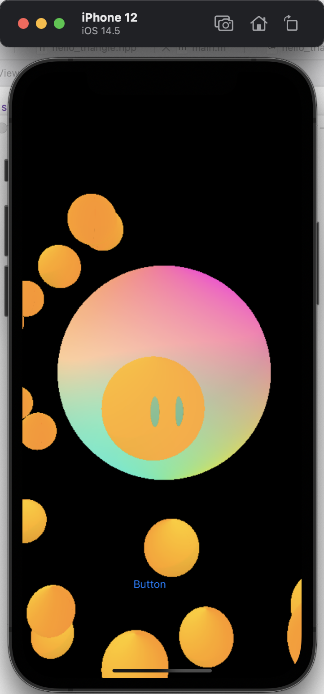
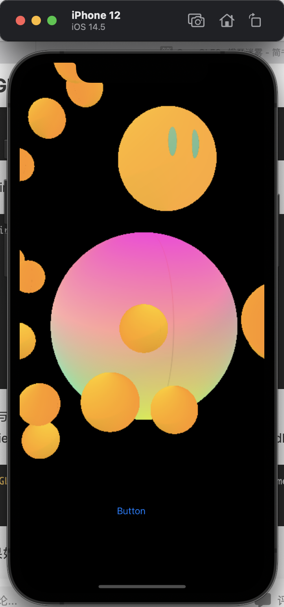
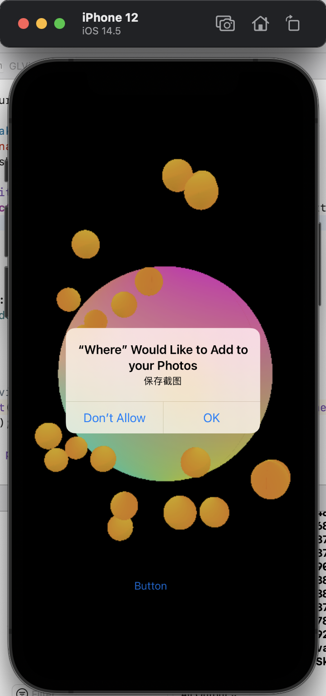
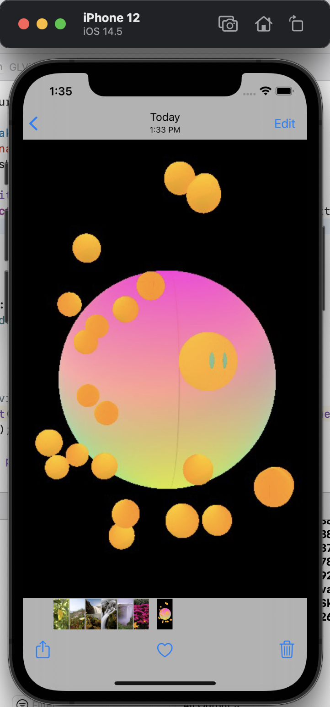

<div class="cover" style="page-break-after:always;font-family:方正公文仿宋;width:100%;height:100%;border:none;margin: 0 auto;text-align:center;">
    <div style="width:60%;margin: 0 auto;height:0;padding-bottom:10%;">
        </br>
        
    </div>
    </br></br></br></br></br>
    <div style="width:60%;margin: 0 auto;height:0;padding-bottom:40%;">
        
	</div>
    </br></br></br></br></br></br></br></br>
    <span style="font-family:华文黑体Bold;text-align:center;font-size:20pt;margin: 10pt auto;line-height:30pt;">《谓尔智能宠物养成APP》</span>
    <p style="text-align:center;font-size:14pt;margin: 0 auto">CG Project </p>
    </br>
    </br>
    <table style="border:none;text-align:center;width:72%;font-family:仿宋;font-size:14px; margin: 0 auto;">
    <tbody style="font-family:方正公文仿宋;font-size:12pt;">
    	<tr style="font-weight:normal;"> 
    		<td style="width:20%;text-align:right;">题　　目</td>
    		<td style="width:2%">：</td> 
    		<td style="width:40%;font-weight:normal;border-bottom: 1px solid;text-align:center;font-family:华文仿宋"> 基于OpenGL框架的智能宠物渲染和游戏机制构建</td>     </tr>
    	<tr style="font-weight:normal;"> 
    		<td style="width:20%;text-align:right;">上课时间</td>
    		<td style="width:2%">：</td> 
    		<td style="width:40%;font-weight:normal;border-bottom: 1px solid;text-align:center;font-family:华文仿宋"> 周二11,12</td>     </tr>
    	<tr style="font-weight:normal;"> 
    		<td style="width:20%;text-align:right;">授课教师</td>
    		<td style="width:2%">：</td> 
    		<td style="width:40%;font-weight:normal;border-bottom: 1px solid;text-align:center;font-family:华文仿宋">唐敏 </td>     </tr>
    	<tr style="font-weight:normal;"> 
    		<td style="width:20%;text-align:right;">姓　　名</td>
    		<td style="width:2%">：</td> 
    		<td style="width:40%;font-weight:normal;border-bottom: 1px solid;text-align:center;font-family:华文仿宋"> 王振阳，李想，高伟渊，王喆</td>     </tr>
    	<tr style="font-weight:normal;"> 
    		<td style="width:20%;text-align:right;">学　　号</td>
    		<td style="width:2%">：</td> 
    		<td style="width:40%;font-weight:normal;border-bottom: 1px solid;text-align:center;font-family:华文仿宋">3190104758等 </td>     </tr>
    	<tr style="font-weight:normal;"> 
    		<td style="width:20%;text-align:right;">组　　别</td>
    		<td style="width:%">：</td> 
    		<td style="width:40%;font-weight:normal;border-bottom: 1px solid;text-align:center;font-family:华文仿宋"> 第十一组</td>     </tr>
    	<tr style="font-weight:normal;"> 
    		<td style="width:20%;text-align:right;">日　　期</td>
    		<td style="width:2%">：</td> 
    		<td style="width:40%;font-weight:normal;border-bottom: 1px solid;text-align:center;font-family:华文仿宋">2020.07.04</td>     </tr>
    </tbody>              
    </table>
</div>

<!-- 注释语句：导出PDF时会在这里分页 -->


# 谓尔智能宠物养成APP

<center><div style='height:2mm;'></div><div style="font-family:华文楷体;font-size:14pt;">第十一组（王振阳，李想，高伟渊，王喆）</div></center>
<center><span style="font-family:华文楷体;font-size:9pt;line-height:9mm">浙江大学计算机学院</span>
</center>
<div>
<div style="width:52px;float:left; font-family:方正公文黑体;">简　介：</div> 
<div style="overflow:hidden; font-family:华文楷体;">谓尔是在2021年开发的一款ios移动应用，通过交互和情感投入转化参数实现宠物养成，通过宠物开展社交，打造模糊社交新模态。
通过谓尔，你可以定制并长期培养自己的专属宠物，通过喂养日记，语音交互，提供定位和健康运动信息，甚至使用其他应用等信息让你的宠物逐渐成长，你的「一举一动」都会对宠物产生影响，使其作出反应，毛玻璃下富于变化的宠物形象满足你的情感需求。
同时，用户可以进入社交模式，在社区中随机浏览和临时领养他人宠物，通过观察和喂养宠物感受宠物主人的生活方式和性格情感，并在社交模式中完成任务解锁特殊成就，崭新的社交形式赋予模糊社交更多可能。
社交模式还支持点对点的宠物长期绑定机制，在绑定机制下，宠物有着更丰富的交互模式，以及允许进行跌倒检测、屏幕时间监控等以满足亲子家庭等关系的特殊需求。</div>
</div>
<div>
<div style="width:52px;float:left; font-family:方正公文黑体;">关键词：</div> 
<div style="overflow:hidden; font-family:华文楷体;">电子宠物；OpenGL；定制化；数字生成艺术</div>
</div>

## 谓尔的模块设计


​    可以看到，APP分为若干模块，本报告仅对其中的图形学模块进行详细的阐述。其中对于大作业要求的若干条目，APP和PC端小游戏满足了如下要求。

- 具有基本体素(立方体、球、柱体、锥体、多面棱柱、多面棱台）的建模表达能力;

- 具有基本三维网格导入导出功能（建议OBJ格式) ;
	- 需要了解OBJ格式，完成基本OBJ模型的读入和导出，不要求处理文件中的纹理和材质信息；
	
- 具有基本材质、纹理的显示和编辑能力;

- 具有基本几何变换功能(旋转、平移、缩放等)﹔

- 基本光照明模型要求，并实现基本的光源编辑（如调整光源的位置，光强等参数);

- 能对建模后场景进行漫游如Zoom In/Out, Pan, Orbit,Zoom To Fit等观察功能。

- 能够提供动画播放功能(多帧数据连续绘制)，能够提供屏幕截取/保存功能。
	- 多帧连续绘制指读取连续的 obj 文件(或其他格式的模型文件)，对其网格进行多次的绘制;简单的平移、旋转、缩放等不能视为动画播放。


​    此外，APP还实现了如下的Bonus：
- 基于可选择的 AABB 碰撞盒和 OBB 碰撞盒实现的实时碰撞检测；

- 多平台支持：在 `iOS`设备上基于 `OpenGL ES`框架实现了电子宠物的交互，在 `PC` 端支持 `Window`s ，`Linux`和 `OSX` 系统，基于 `cmakelist` 进行文件组织，实现了多平台的兼容；
	
- 基于核心的物理引擎，实现了较有难度的一类吃豆人游戏。
	
	

## 谓尔基本模块实现

### 类图


各个元素之间的继承派生关系如图。可以看到，在代码组织中，我们使用 `Entity` 抽象出单个元素，将所有的 `Shader`，`Texture`，`Material` 封装于其中。通过构造函数传递参数的方式指定元素需要的所有参数，并且在需要绘制的时候直接调用 `draw()`，抽象逻辑层次。对于元素进行改变完全由场景进行管理和计算。


### 场景管理

首先，场景的初始配置文件由一个 `json` 文件指定。`json` 文件的格式如下：

```json
{
    "skybox" : [
        "${leftImgPath}",
        "${rightImgPath}",
        "${upImgPath}",
        "${downImgPath}",
        "${frontImgPath}",
        "${backImgPath}"
    ],
    "camera" : {
        "position" : "${vec3}",
        "rotation" : "${vec3}"
    },
    "light" : {
        "totalNum" : "${totalNum}",
        "lightEntity" : [
            {
                "type" : "direcct",
                "position" : "${vec3}",
                "rotation" : "${vec3}",
                "insensity" : "${float}",
                "color" : "${vec3}"
            },
            {
                "type" : "direcct",
                "position" : "${vec3}",
                "rotation" : "${vec3}",
                "insensity" : "${float}",
                "color" : "${vec3}"
            }
        ]
    },
    "EntityNum" : "${EntityNum}",
    "Entity" : [
        {
            "type" : "Model|Element",
            "objFilePaht" : "${filePath}",
            "position" : "${vec3}",
            "rotation" : "${vec3}",
            "scale" : "${float}",
            "material" : "${struct}",
            "texture" : "${struct}"
        }
    ]
    
}

```

`json` 由 https://github.com/nlohmann/json 提供的json库进行解析，在代码文件中，为了避免跨平台带来的不确定问题。提交的版本没有使用 json 解析的形式，而是将参数预先给定。方便展示。


### 物理模型
#### AABB 包围盒

AABB 名叫**轴对齐包围盒**（Axis align bounding box），轴对齐意思即是与 x，y 轴对齐，包围盒顾名思义是一个矩形，因此不难想到 AABB 是一个**包裹物体的最小外接矩形**。除 AABB 外，还有 OBB 方向包围盒（Oriented bounding Box）等。

一个物体与其 AABB 如下图所示：

[](https://github.com/phenomLi/Blog/raw/master/photos/2020-4-16/微信截图_20200416165905.png)

可以有很多方式定义 AABB。

[](https://github.com/phenomLi/Blog/raw/master/photos/2020-4-16/微信截图_20200416170628.png)

我们给常见的几个物体都加上 AABB：
 [](https://github.com/phenomLi/Blog/raw/master/photos/2020-4-16/微信截图_20200416171025.png)

现在，我们把 5 个物体简化为 5 个矩形了，之后我们就可以使用这 5 个 AABB 矩形来快速筛选掉不可能发生碰撞的物体。


为什么使用矩形？使用矩形的好处是判断矩形的相交十分容易。**检测AABB包围盒相交的本质是判断两个矩形是否相交，问题可以再一步转化为与两对与x，y轴平行的线段的在x，y轴的投影的重叠检测。**
 [](https://github.com/phenomLi/Blog/raw/master/photos/2020-4-16/微信截图_20200415234557.png)

而检测两条共线线段是否重叠，基本思想是比较两条线段的开始端点和结束端点的大小。但是由于两条线段的位置是任意的，所以在进行比较时，要分线段的先后情况讨论。我们假设两条投影线段分别为L1, L2。
 [](https://github.com/phenomLi/Blog/raw/master/photos/2020-4-16/微信截图_20190522170309.png)
 [](https://github.com/phenomLi/Blog/raw/master/photos/2020-4-16/微信截图_20190522170439.png)

因此可以看到，两 AABB 相交检测的复杂度为 O(1)，比执行一次完整的 SAT 或 GJK  要快的多。由于其简单高效的特性，除物理引擎外，AABB 还被应用在许多需要进行“快速筛选”的场景。比如说某些图形库可以利用 AABB  快速判断鼠标指针是否落在某个图形内，有些可视化工具利用 AABB 来计算视图占据的位置，或者快速检测两个图形有没有发生重叠遮挡等。

### 游戏机制
在PC版中我们设计了一个小游戏，小游戏的机制是，小精灵在场景内游走，在游走过程中小精灵会与场景内的体素发生碰撞并吃掉，吃掉的同时小精灵的身体会长大。

这个小游戏的实现主要分为三部分。

第一部分是开始时随机生成一定数量的体素供小球吞食。

```c++
for (int i = 0; i < _amount1; ++i) {

		_balls[i].reset(new Ball(0.05f));
		_cubics[i].reset(new Cubic(1.0f));
		_ellipsoids[i].reset(new Ellipsoid(0.3f, 1.0f, 2.0f));
		_cylinders[i].reset(new Cylinder(0.5f,0.6f));
		_cones[i].reset(new Cone(1.0f,1.6f));
		_prisms[i].reset(new Prism(1.5f,0.6f,6));

		float angle = (float)i / _amount1 * 360.0f;
		float displacement = (rand() % (int)(2 * offset * 100)) / 100.0f - offset;
		_elementPositions[i].x = _position.x+sin(angle) * radius+displacement;
		displacement = (rand() % (int)(2 * offset * 100)) / 100.0f - offset;
		
		_elementPositions[i].y = displacement * 0.2f;
		displacement = (rand() % (int)(2 * offset * 100)) / 100.0f - offset;
		_elementPositions[i].z = _position.z+sin(angle) * radius+displacement;
		
		// scale
		_elementScales[i] = glm::vec3(1.0f, 1.0f, 1.0f);
		// rotate
		float rotAngle = 1.0f * (rand() % 360);
		_elementRotations[i] = glm::angleAxis(rotAngle, axis)* rotation;
	}
```

 第二部分是对场景内的小球遍历，对小球位置进行判断，如果小球坐标与小精灵所在的范围相重合，则将小球位置设置在天空盒外，同时修改小精灵的scale，否则则按一开始生成的位置信息将小球绘制出来。

```c++
_balls[i].get()->setDirectionalLight(_direction1,_color1,_intensity1);
		_balls[i].get()->setSpotLight(_direction,_color,_intensity,_angle,_kc,_kl,_kq);
		_balls[i].get()->setMaterial(_albedo,_ka,_kd,_ks,_ns,_blend);
		
		_balls[i].get()->setPosition(glm::vec3(_cameras[0]->position.x+_elementPositions[i].x,_cameras[0]->position.y+_elementPositions[i].y,_cameras[0]->position.z+_elementPositions[i].z-15)); 
		_balls[i].get()->setRotation(_elementRotations[i]); 
		_balls[i].get()->setScale(_elementScales[i]); 
		

		if (-0.005<_balls[i].get()->getPosition().x<0.005 &&
		 -0.005<_balls[i].get()->getPosition().y < 0.005 ){
		//   -0.005<_balls[i].get()->getPosition().z < 0.01
			_balls[i].get()->setPosition(glm::vec3(0.0,0.0,10000.0));
			_elementPositions[i]=glm::vec3(0.0,0.0,10000.0);
			change+=0.05;
			radius1 +=0.5;

		// } else if (_models[count]->getPosition().x-0.0001<_balls[i].get()->getPosition().x<_models[count]->getPosition().x+0.0001 && _models[count]->getPosition().y-0.0001<_balls[i].get()->getPosition().y<_models[count]->getPosition().y+0.0001 && _models[count]->getPosition().z-0.0001<_balls[i].get()->getPosition().z<_models[count]->getPosition().z+0.0001) {
		// 	_balls[i].get()->setPosition(_elementPositions[i]);
		}else{
			_balls[i].get()->draw(projection, view, viewPos);
		}
```

第三部分是将场景内体素与相机绑定，通过体素跟随相机运动实现与小精灵在场景中移动的效果，从而简化了对小精灵坐标的计算，使小精灵实际上始终保持在坐标(0,0,0)处。

```
balls[i].get()->setPosition(glm::vec3(_cameras[0]->position.x+_elementPositions[i].x,_cameras[0]->position.y+_elementPositions[i].y,_cameras[0]->position.z+_elementPositions[i].z-15)); 
```

场景开始和短暂漫游后的对比：
显而易见的，结束时小精灵体积显著增大，场景中小球数量减少。


## PC 端效果演示

1 基本体素（立方体、球、圆柱、圆锥、多面棱柱、多面棱台）的建模表达能力

体素的基类为ElementEntity，该基类为对Element类（Element类继承了object3d类）的封装，构造函数（根据vertices和indices构造）和draw函数里都调用了Element类的构造函数根据vertices和indices构造）和draw函数。

每个构造函数代码的结构均类似，先计算出每个三角形面片的3个顶点（vertices）和对应绘制顺序（indices）,再调用进行构造，再设置shader，material，texture 再根据构造函数的参数设置scale，绘制时统一调用基类ElementEntity的draw函数进行绘制。

以下依次说明各个类的vertices和indices计算方法：

以下依次为球、椭球、立方体、圆柱、圆锥、多面棱柱的类定义，每个类分别有特定的构造函数可以根据指定的参数进行构造。默认的position和rotation均为object3d中的默认值，scale按照构造函数接收的参数设置。构造函数的参数依次为：


球：半径radius

顶点位置、法向量（顶点位置-原点位置（0,0,0））、纹理坐标（贴图均匀分格采样）

```C++
for (int y = 0; y <= segments; y++)
	{
		for (int x = 0; x <= segments; x++)
		{
			Vertex vertex{};
			float xSegment = (float)x / (float)segments;
			float ySegment = (float)y / (float)segments;
			float xPos = std::cos(xSegment * 2.0f * PI) * std::sin(ySegment * PI);
			float yPos = std::cos(ySegment * PI);
			float zPos = std::sin(xSegment * 2.0f * PI) * std::sin(ySegment * PI);
			vertex.position.x = xPos;
			vertex.position.y = yPos;
			vertex.position.z = zPos;
			vertex.normal.x = xPos;
			vertex.normal.y = yPos;
			vertex.normal.z = zPos;
			vertex.texCoord.x = 1 - xSegment;
			vertex.texCoord.y = 1 - ySegment;
			vertices.push_back(vertex);
		}
	}
```

绘制顺序

```c++
//indices
	for (int i = 0; i < segments; i++)
	{
		for (int j = 0; j < segments; j++)
		{
			indices.push_back(i * (segments + 1) + j);
			indices.push_back((i + 1) * (segments + 1) + j);
			indices.push_back((i + 1) * (segments + 1) + j + 1);
			indices.push_back(i * (segments + 1) + j);
			indices.push_back((i + 1) * (segments + 1) + j + 1);
			indices.push_back(i * (segments + 1) + j + 1);
		}
	}
	_element.reset(new Element(vertices, indices));
```


椭球：xyz三个轴的长度xaxis，yaxis，zaxis。

```c++
	for (int y = 0; y <= segments; y++)
	{
		for (int x = 0; x <= segments; x++)
		{
			Vertex vertex{};
			float xSegment = (float)x / (float)segments;
			float ySegment = (float)y / (float)segments;
			float xPos = std::cos(xSegment * 2.0f * PI) * std::sin(ySegment * PI);
			float yPos = std::cos(ySegment * PI);
			float zPos = std::sin(xSegment * 2.0f * PI) * std::sin(ySegment * PI);
			vertex.position.x = xPos;
			vertex.position.y = yPos;
			vertex.position.z = zPos;
			vertex.normal.x = xPos;
			vertex.normal.y = yPos;
			vertex.normal.z = zPos;
			vertex.texCoord.x = 1 - xSegment;
			vertex.texCoord.y = 1 - ySegment;
			vertices.push_back(vertex);
		}
	}

	//indices
	for (int i = 0; i < segments; i++)
	{
		for (int j = 0; j < segments; j++)
		{
			indices.push_back(i * (segments + 1) + j);
			indices.push_back((i + 1) * (segments + 1) + j);
			indices.push_back((i + 1) * (segments + 1) + j + 1);
			indices.push_back(i * (segments + 1) + j);
			indices.push_back((i + 1) * (segments + 1) + j + 1);
			indices.push_back(i * (segments + 1) + j + 1);
		}
	}
	_element.reset(new Element(vertices, indices));
```


立方体：边长size

六个面的三角形顶点坐标和纹理坐标（每个面一张贴图）

```C++
	static const float position[6][6][5] = {
		// left
		-0.5f, -0.5f, -0.5f,  0.0f, 1.0f,
		-0.5f, -0.5f,  0.5f,  1.0f, 1.0f,
		-0.5f,  0.5f,  0.5f,  1.0f, 0.0f,
		-0.5f,  0.5f,  0.5f,  1.0f, 0.0f,
		-0.5f,  0.5f, -0.5f,  0.0f, 0.0f,
		-0.5f, -0.5f, -0.5f,  0.0f, 1.0f,

		// right
		0.5f, -0.5f,  0.5f,  0.0f, 1.0f,
		0.5f, -0.5f, -0.5f,  1.0f, 1.0f,
		0.5f,  0.5f, -0.5f,  1.0f, 0.0f,
		0.5f,  0.5f, -0.5f,  1.0f, 0.0f,
		0.5f,  0.5f,  0.5f,  0.0f, 0.0f,
		0.5f, -0.5f,  0.5f,  0.0f, 1.0f,

		// top
		-0.5f,  0.5f,  0.5f,  0.0f, 1.0f,
		0.5f,  0.5f,  0.5f,  1.0f, 1.0f,
		0.5f,  0.5f, -0.5f,  1.0f, 0.0f,
		0.5f,  0.5f, -0.5f,  1.0f, 0.0f,
		-0.5f,  0.5f, -0.5f,  0.0f, 0.0f,
		-0.5f,  0.5f,  0.5f,  0.0f, 1.0f,

		// bottom
		-0.5f, -0.5f, -0.5f,  0.0f, 1.0f,
		0.5f, -0.5f, -0.5f,  1.0f, 1.0f,
		0.5f, -0.5f,  0.5f,  1.0f, 0.0f,
		0.5f, -0.5f,  0.5f,  1.0f, 0.0f,
		-0.5f, -0.5f,  0.5f,  0.0f, 0.0f,
		-0.5f, -0.5f, -0.5f,  0.0f, 1.0f,

		// front
		-0.5f, -0.5f,  0.5f,  0.0f, 1.0f,
		0.5f, -0.5f,  0.5f,  1.0f, 1.0f,
		0.5f,  0.5f,  0.5f,  1.0f, 0.0f,
		0.5f,  0.5f,  0.5f,  1.0f, 0.0f,
		-0.5f,  0.5f,  0.5f,  0.0f, 0.0f,
		-0.5f, -0.5f,  0.5f,  0.0f, 1.0f,

		// back
		0.5f, -0.5f, -0.5f,  0.0f, 1.0f,
		-0.5f, -0.5f, -0.5f,  1.0f, 1.0f,
		-0.5f,  0.5f, -0.5f,  1.0f, 0.0f,
		-0.5f,  0.5f, -0.5f,  1.0f, 0.0f,
		0.5f,  0.5f, -0.5f,  0.0f, 0.0f,
		0.5f, -0.5f, -0.5f,  0.0f, 1.0f,
	};

	
```

法向量

```c++
static const float normals[6][3] = {
		{ -1, 0, 0 },
		{ +1, 0, 0 },
		{ 0, +1, 0 },
		{ 0, -1, 0 },
		{ 0, 0, +1 },
		{ 0, 0, -1 }
	};
```

绘制
```c++
	std::vector<Vertex> vertices;
	std::vector<uint32_t> indices;
	uint32_t indice = 0;
	for (int i = 0; i < 6; i++) {
		for (int v = 0; v < 6; v++) {
			Vertex vertex{};
			vertex.position.x = position[i][v][0];
			vertex.position.y = position[i][v][1];
			vertex.position.z = position[i][v][2];
			vertex.normal.x = normals[i][0];
			vertex.normal.y = normals[i][1];
			vertex.normal.z = normals[i][2];
			vertex.texCoord.x = 1 - position[i][v][3];
			vertex.texCoord.y = 1 - position[i][v][4];
			vertices.push_back(vertex);
			indices.push_back(indice);
			indice++;
		}
	}
	
	_element.reset(new Element(vertices, indices));
```


圆柱：底面圆的半径radius，高度height

分成上圆面、中间柱面、下圆面三部分绘制

上圆面（法向量朝上，圆面贴图）
```c++
std::vector<Vertex> vertices;
	std::vector<uint32_t> indices;
	uint32_t indice = 0;
	int sidecount = 36;
	float y = height / 2.0;
	

	//up circle
	Vertex vertexup{};
	vertexup.position.x = 0;
	vertexup.position.y = y;
	vertexup.position.z = 0;
	vertexup.normal.x = 0;
	vertexup.normal.y = 1;
	vertexup.normal.z = 0;
	vertexup.texCoord.x = 0.5;
	vertexup.texCoord.y = 0.5;
	
	for (int i = sidecount; i >= 0; --i) {
		float angle = i / (float)sidecount * PI * 2;
		vertices.push_back(vertexup);
		indices.push_back(indice);
		indice++;
		Vertex vertex{};
		vertex.position.x = cos(angle) * radius;
		vertex.position.y = y;
		vertex.position.z = sin(angle) * radius;
		vertex.normal.x = 0;
		vertex.normal.y = 1;
		vertex.normal.z = 0;
		vertex.texCoord.x = (cos(angle) + 1) / 2.0;
		vertex.texCoord.y = (sin(angle) + 1) / 2.0;
		vertices.push_back(vertex);
		indices.push_back(indice);
		indice++;
	
		angle = (i + 1) / (float)sidecount * PI * 2;
		vertex.position.x = cos(angle) * radius;
		vertex.position.y = y;
		vertex.position.z = sin(angle) * radius;
		vertex.normal.x = 0;
		vertex.normal.y = 1;
		vertex.normal.z = 0;
		vertex.texCoord.x = (cos(angle) + 1) / 2.0;
		vertex.texCoord.y = (sin(angle) + 1) / 2.0;
		vertices.push_back(vertex);
		indices.push_back(indice);
		indice++;
	}
```
中间柱面（法向量水平向外，柱面贴图）

```c++
	//bottom circle
	Vertex vertexdown{};
	y = -height / 2.0;
	vertexdown.position.x = 0;
	vertexdown.position.y = y;
	vertexdown.position.z = 0;
	vertexdown.normal.x = 0;
	vertexdown.normal.y = -1;
	vertexdown.normal.z = 0;
	vertexdown.texCoord.x = 0.5;
	vertexdown.texCoord.y = 0.5;
	for (int i = 0; i <= sidecount; ++i) {
		vertices.push_back(vertexdown);
		indices.push_back(indice);
		indice++;

		float angle = i / (float)sidecount * PI * 2;
		Vertex vertex{};
		vertex.position.x = cos(angle) * radius;
		vertex.position.y = y;
		vertex.position.z = sin(angle) * radius;
		vertex.normal.x = 0;
		vertex.normal.y = -1;
		vertex.normal.z = 0;
		vertex.texCoord.x = (cos(angle) + 1) / 2.0;
		vertex.texCoord.y = (sin(angle) + 1) / 2.0;
		vertices.push_back(vertex);
		indices.push_back(indice);
		indice++;

		angle = (i + 1) / (float)sidecount * PI * 2;
		vertex.position.x = cos(angle) * radius;
		vertex.position.y = y;
		vertex.position.z = sin(angle) * radius;
		vertex.normal.x = 0;
		vertex.normal.y = -1;
		vertex.normal.z = 0;
		vertex.texCoord.x = (cos(angle) + 1) / 2.0;
		vertex.texCoord.y = (sin(angle) + 1) / 2.0;
		vertices.push_back(vertex);
		indices.push_back(indice);
		indice++;
	}
```

下圆面（法向量朝下，圆面贴图）
```c++
		//middle rectangles
		float yup = height / 2.0;
		float ydown = -height / 2.0;
		for (int i = 0; i <= sidecount; ++i) {
			GLfloat angle = i / (float)sidecount * PI * 2;
			Vertex vertex{};
			vertex.position.x = cos(angle) * radius;
			vertex.position.y = yup;
			vertex.position.z = sin(angle) * radius;
			vertex.normal.x = cos(angle) * radius;
			vertex.normal.y = 0;
			vertex.normal.z = sin(angle) * radius;
			vertex.texCoord.x = 1 - i / (float)sidecount;
			vertex.texCoord.y = 1;
			vertices.push_back(vertex);
			indices.push_back(indice);
			indice++;
		vertex.position.x = cos(angle) * radius;
		vertex.position.y = ydown;
		vertex.position.z = sin(angle) * radius;
		vertex.normal.x = cos(angle) * radius;
		vertex.normal.y = 0;
		vertex.normal.z = sin(angle) * radius;
		vertex.texCoord.x = 1 - i / (float)sidecount;
		vertex.texCoord.y = 0;
		vertices.push_back(vertex);
		indices.push_back(indice);
		indice++;
	
		angle = (i + 1) / (float)sidecount * PI * 2;
		vertex.position.x = cos(angle) * radius;
		vertex.position.y = yup;
		vertex.position.z = sin(angle) * radius;
		vertex.normal.x = cos(angle) * radius;
		vertex.normal.y = 0;
		vertex.normal.z = sin(angle) * radius;
		vertex.texCoord.x = 1 - (i + 1) / (float)sidecount;
		vertex.texCoord.y = 1;
		vertices.push_back(vertex);
		indices.push_back(indice);
		indice++;
	
		angle = i / (float)sidecount * PI * 2;
		vertex.position.x = cos(angle) * radius;
		vertex.position.y = ydown;
		vertex.position.z = sin(angle) * radius;
		vertex.normal.x = cos(angle) * radius;
		vertex.normal.y = 0;
		vertex.normal.z = sin(angle) * radius;
		vertex.texCoord.x = 1 - i / (float)sidecount;
		vertex.texCoord.y = 0;
		vertices.push_back(vertex);
		indices.push_back(indice);
		indice++;
	
		angle = (i + 1) / (float)sidecount * PI * 2;
		vertex.position.x = cos(angle) * radius;
		vertex.position.y = yup;
		vertex.position.z = sin(angle) * radius;
		vertex.normal.x = cos(angle) * radius;
		vertex.normal.y = 0;
		vertex.normal.z = sin(angle) * radius;
		vertex.texCoord.x = 1 - (i + 1) / (float)sidecount;
		vertex.texCoord.y = 1;
		vertices.push_back(vertex);
		indices.push_back(indice);
		indice++;
	
		vertex.position.x = cos(angle) * radius;
		vertex.position.y = ydown;
		vertex.position.z = sin(angle) * radius;
		vertex.normal.x = cos(angle) * radius;
		vertex.normal.y = 0;
		vertex.normal.z = sin(angle) * radius;
		vertex.texCoord.x = 1 - (i + 1) / (float)sidecount;
		vertex.texCoord.y = 0;
		vertices.push_back(vertex);
		indices.push_back(indice);
		indice++;
	}
	
	_element.reset(new Element(vertices, indices));
```


圆锥：底面圆的半径radius，高度height

只需在圆柱代码上稍作改动，减少一个上圆面的绘制，中间柱面改为由从上顶点到下圆面的三角形组成的圆锥面。

下圆面（法向量朝下，圆面贴图）

```c++
	std::vector<Vertex> vertices;
	std::vector<uint32_t> indices;
	uint32_t indice = 0;
	int sidecount = 36;

	//bottom circle
	Vertex vertexdown{};
	float yup = height / 2.0;
	float ydown = -height / 2.0;
	vertexdown.position.x = 0;
	vertexdown.position.y = ydown;
	vertexdown.position.z = 0;
	vertexdown.normal.x = 0;
	vertexdown.normal.y = -1;
	vertexdown.normal.z = 0;
	vertexdown.texCoord.x = 0.5;
	vertexdown.texCoord.y = 0.5;
	for (int i = 0; i <= sidecount; ++i) {
		vertices.push_back(vertexdown);
		indices.push_back(indice);
		indice++;

		float angle = i / (float)sidecount * PI * 2;
		Vertex vertex{};
		vertex.position.x = cos(angle) * radius;
		vertex.position.y = ydown;
		vertex.position.z = sin(angle) * radius;
		vertex.normal.x = 0;
		vertex.normal.y = -1;
		vertex.normal.z = 0;
		vertex.texCoord.x = (cos(angle) + 1) / 2.0;
		vertex.texCoord.y = (sin(angle) + 1) / 2.0;
		vertices.push_back(vertex);
		indices.push_back(indice);
		indice++;

		angle = (i + 1) / (float)sidecount * PI * 2;
		vertex.position.x = cos(angle) * radius;
		vertex.position.y = ydown;
		vertex.position.z = sin(angle) * radius;
		vertex.normal.x = 0;
		vertex.normal.y = -1;
		vertex.normal.z = 0;
		vertex.texCoord.x = (cos(angle) + 1) / 2.0;
		vertex.texCoord.y = (sin(angle) + 1) / 2.0;
		vertices.push_back(vertex);
		indices.push_back(indice);
		indice++;
	}

	//uppoint
	Vertex vertexup{};
	vertexup.position.x = 0;
	vertexup.position.y = yup;
	vertexup.position.z = 0;
	vertexup.normal.x = 0;
	vertexup.normal.y = 1;
	vertexup.normal.z = 0;
	vertexup.texCoord.x = 0.5;
	vertexup.texCoord.y = 0.5;
	for (int i = sidecount; i >= 0; --i) {
		float angle = i / (float)sidecount * PI * 2;
		vertices.push_back(vertexup);
		indices.push_back(indice);
		indice++;
		Vertex vertex{};
		vertex.position.x = cos(angle) * radius;
		vertex.position.y = ydown;
		vertex.position.z = sin(angle) * radius;
		vertex.normal.x = 0;
		vertex.normal.y = 1;
		vertex.normal.z = 0;
		vertex.texCoord.x = (cos(angle) + 1) / 2.0;
		vertex.texCoord.y = (sin(angle) + 1) / 2.0;
		vertices.push_back(vertex);
		indices.push_back(indice);
		indice++;

		angle = (i + 1) / (float)sidecount * PI * 2;
		vertex.position.x = cos(angle) * radius;
		vertex.position.y = ydown;
		vertex.position.z = sin(angle) * radius;
		vertex.normal.x = 0;
		vertex.normal.y = 1;
		vertex.normal.z = 0;
		vertex.texCoord.x = (cos(angle) + 1) / 2.0;
		vertex.texCoord.y = (sin(angle) + 1) / 2.0;
		vertices.push_back(vertex);
		indices.push_back(indice);
		indice++;
	}
	
	_element.reset(new Element(vertices, indices));
```


多面棱柱：底面多边形的半径radius，高度height，多面棱柱的面数facenum（3,4,5……）

和圆柱一模一样，因为圆柱相当于面数为无穷大的多面棱柱，只需将圆柱代码中的sidecount设为面数facenum即可。

```c++
int sidecount = facenum;
```
2 场景漫游

场景漫游通过在entity中调用camera类，分别利用WASD进行方向控制，同时采用鼠标点按拖拽。

```c++
if (_keyboardInput.keyStates[GLFW_KEY_W] != GLFW_RELEASE) {
		std::cout << "W" << std::endl;
		camera->position += camera->getFront()*_cameraMoveSpeed;
	}

	if (_keyboardInput.keyStates[GLFW_KEY_A] != GLFW_RELEASE) {
		std::cout << "A" << std::endl;
		camera->position -= glm::normalize(glm::cross(camera->getFront(), camera->getUp())) * _cameraRotateSpeed*3.0;
	}

	if (_keyboardInput.keyStates[GLFW_KEY_S] != GLFW_RELEASE) {
		std::cout << "S" << std::endl;
		camera->position -= camera->getFront()*_cameraMoveSpeed;
	}

	if (_keyboardInput.keyStates[GLFW_KEY_D] != GLFW_RELEASE) {
		std::cout << "D" << std::endl;
		camera->position += glm::normalize(glm::cross(camera->getFront(), camera->getUp())) * _cameraRotateSpeed*3.0;
	}

	if (_mouseInput.move.xCurrent != _mouseInput.move.xOld) {
		if (_mouseInput.click.left == true){
		std::cout << "mouse move in x direction" << std::endl;
		const float angle = -_cameraRotateSpeed * _deltaTime * (_mouseInput.move.xCurrent - _mouseInput.move.xOld);
		const glm::vec3 axis1 = { 0.0f, 1.0f, 0.0f };
		const glm::vec3 axis2 = camera->getRight();
		angle1 -= angle;
		camera->rotation = { glm::cos(angle * 0.5f),axis2[0] * glm::sin(angle2*0.5f) , axis1[1] * glm::sin(angle1*0.5f)+ axis2[1] * glm::sin(angle1* 0.5f), 0.0f };
		}
		_mouseInput.move.xOld = _mouseInput.move.xCurrent;
	}

	if (_mouseInput.move.yCurrent != _mouseInput.move.yOld) {
		if (_mouseInput.click.left == true){
		std::cout << "mouse move in y direction" << std::endl;
		/* write your code here */
		// rotate around local right
		const float angle = -_cameraRotateSpeed * _deltaTime * (_mouseInput.move.yCurrent - _mouseInput.move.yOld);
		const glm::vec3 axis1 = { 0.0f, 1.0f, 0.0f };
		const glm::vec3 axis2 = camera->getRight();
		// you should know how quaternion works to represent rotation
		// camera->rotation = ...
		angle2 -= angle;
		camera->rotation = { glm::cos(angle * 0.5f),axis2[0] * glm::sin(angle2*0.5f) , axis1[1] * glm::sin(angle1*0.5f) + axis2[1] * glm::sin(angle1* 0.5f), 0.0f };
		}
		_mouseInput.move.yOld = _mouseInput.move.yCurrent;
	}
```
漫游效果：


3 几何变换

几何变换体现在所有的图形上

其中重点以背景planet的生成为例介绍几何变换。

因为图形学中生成的球体实际上是一个多面体，因此当多个球体叠加时会出现花纹交叠的特性，正是利用这一特性我们生成了背景的灯球：即通过三个相同坐标但旋转轴不同的球体，对其贴上颜色较复杂的贴图然后按各自轴转动，即产生了相应效果。

创建planet数组，并利用rand()随机生成旋转角度

```c++
for (int i = 0; i < 3; ++i) {
	_planets[i].reset(new ModelEntity(filepath,blendTexturePaths5,blendTexturePaths6));
	}
```

```c++
float rotAngle = 1.0f * (rand() % 360);
_elementRotations[i] = glm::angleAxis(rotAngle, axis)* rotation;
```

绘制

```c++
for (int i= 0;i<3;i++){
		const glm::vec3 axis1 = glm::vec3(1.0f, 0.0f, 0.0f);	
		_elementRotations[i] *= glm::angleAxis(angle, axis1);

		_planets[i]->setDirectionalLight(_direction1,_color1,_intensity1);
		_planets[i]->setSpotLight(_lightPosition,_direction,_color,_intensity,_angle,_kc,_kl,_kq);
		_planets[i]->setMaterial(_albedo,_ka,_kd,_ks,_ns,_blend);


		_planetPosition = glm::vec3(_cameras[0]->position.x+200,_cameras[0]->position.y+200,_cameras[0]->position.z-1000);
		_planets[i]->setRotation(_elementRotations[i]);
		_planets[i]->setScale(glm::vec3(400.0,400.0,400.0));
		_planets[i]->setPosition(_planetPosition);
		_planets[i]->draw(projection, view, viewPos);
	}

```
效果如下


4 贴图和光照

基本体素等均用到了贴图，其中最主要的就是小精灵的眼睛与身体贴图混合

整个场景采用了冯光照和贴图混合的形式，同时采用diretionalLight和spotLight两种光照，均可用通过GUI进行编辑。

片段着色器代码如下：

```c++
const char* fragCode =
		"#version 330 core\n"
		"in vec3 FragPos;\n"
		"in vec3 Normal;\n"
		"in vec2 TexCoord;\n"
		"out vec4 color;\n"

		"struct DirectionalLight {\n"
		"	vec3 direction;\n"
		"	vec3 color;\n"
		"	float intensity;\n"
		"};\n"

		"struct SpotLight {\n"
		"	vec3 position;\n"
		"	vec3 direction;\n"
		"	float intensity;\n"
		"	vec3 color;\n"
		"	float angle;\n"
		"	float kc;\n"
		"	float kl;\n"
		"	float kq;\n"
		"};\n"

		"struct Material {\n"
		"	vec3 albedo;\n"
		"	float ka;\n"
		"	vec3 kd;\n"
		"	vec3 ks;\n"
		"	float ns;\n"
		"	float blend;\n"
		"};\n"

		"// uniform variables\n"
		"uniform Material material;\n"
		"uniform DirectionalLight directionalLight;\n"
		"uniform SpotLight spotLight;\n"
		"uniform vec3 viewPos;\n"
		"uniform float depth;\n"
		"uniform sampler2D mapKd1;\n"
		"uniform sampler2D mapKd2;\n"

		"vec3 calcDirectionalLight(vec3 normal) {\n"
		"	vec3 lightDir = normalize(-directionalLight.direction);\n"
		"// diffuse color\n" 
		"	vec3 diffuse = directionalLight.color * max(dot(lightDir, normal), 0.0f) * material.kd;\n"
		"// specular color\n"
		"	vec3 viewDir = normalize(viewPos - FragPos);\n"
		"	vec3 reflectDir = reflect(-lightDir, normal);\n"
		"	vec3 specular = directionalLight.color * pow(max(dot(viewDir, reflectDir), 0.0f), material.ns) * material.ks;\n"
		"	return directionalLight.intensity * diffuse + directionalLight.intensity * specular ;\n"
		"}\n"

		"vec3 calcSpotLight(vec3 normal) {\n"
		"	vec3 lightDir = normalize(spotLight.position - FragPos);\n"
		"	float theta = acos(-dot(lightDir, normalize(spotLight.direction)));\n"
		"	if (theta > spotLight.angle) {\n"
		"		return vec3(0.0f, 0.0f, 0.0f);\n"
		"	}\n"
		"	vec3 diffuse = spotLight.color * max(dot(lightDir, normal), 0.0f) * material.kd;\n"
		"// specular color\n"
		"	vec3 viewDir = normalize(viewPos - FragPos);\n"
		"	vec3 reflectDir = reflect(-lightDir, normal);\n"
		"	vec3 specular = spotLight.color * pow(max(dot(viewDir, reflectDir), 0.0f), material.ns) * material.ks;\n"
		"	float distance = length(spotLight.position - FragPos);\n"

		"	float attenuation = 1.0f / (spotLight.kc + spotLight.kl * distance + spotLight.kq * distance * distance);\n"
		"	return spotLight.intensity * attenuation * diffuse + spotLight.intensity * attenuation * specular;\n"
		"}\n"

		"void main() {\n"
		"	vec3 ambient = material.ka * material.albedo;\n"
		"	vec3 normal = normalize(Normal);\n"
    	"	float blur = 0.0;\n"
 
    	"	float far_distance = 10.0;\n"
    	"	float far_plane = 0.0;\n"
 
        "	blur = clamp(depth, far_plane - far_distance, far_plane);\n"
        "	blur = (far_plane - blur) / far_distance;\n"

		"	// diffuse color\n"
		"	vec3 diffuse = calcDirectionalLight(normal);\n"
		"	vec4 tex = mix(texture(mapKd1, TexCoord), texture(mapKd2, TexCoord), material.blend);\n"
		"	color = vec4(ambient + diffuse, 1.0f) * tex;\n"
		"	color.a = blur;\n"
		"}\n";
```

由于shader被写在modelEntity和elementEntity中，为了能通过Entity类的参数来控制光照变化，我们专门设置了几个函数用于传输和编辑相关数值

```c++
void setDirectionalLight(glm::vec3 direction,glm::vec3 color,float intensity);
void setSpotLight(glm::vec3 position,glm::vec3 direction,glm::vec3 color,float intensity, float angle, float kc, float kl,float kq);
void setMaterial(glm::vec3 albedo,float ka,glm::vec3 kd,glm::vec3 ks, float ns,float blend);
```

具体的使用和GUI控制如下：

```c++
_body->setDirectionalLight(_direction1,_color1,_intensity1);
	_body->setSpotLight(_lightPosition,_direction,_color,_intensity,_angle,_kc,_kl,_kq);
	_body->setMaterial(_albedo,_ka,_kd,_ks,_ns,_blend);
```

```c++
ImGui::Text("Render Mode");

		ImGui::Text("directional light");
		ImGui::Separator();
		ImGui::SliderFloat("intensity##1", &_intensity1, 0.0f, 2.0f);
		ImGui::ColorEdit3("color##1", (float*)&_color1);
		ImGui::NewLine();

		ImGui::Text("spot light");
		ImGui::Separator();
		ImGui::SliderFloat("intensity##2", &_intensity, 0.0f, 5.0f);
		ImGui::ColorEdit3("color##2", (float*)&_color);
		ImGui::SliderFloat("angle##2", (float*)&_angle, 0.0f, glm::radians(180.0f), "%f rad");
		ImGui::NewLine();

		ImGui::Text("Material");
		ImGui::Separator();
		ImGui::ColorEdit3("albedo", (float*)&_albedo);
		ImGui::SliderFloat("ka", &_ka, 0.0f, 1.0f);
		ImGui::ColorEdit3("kd", (float*)&_kd);
		ImGui::ColorEdit3("ks", (float*)&_ks);
		ImGui::SliderFloat("ns", &_ns, 0.0f, 50.0f);
		ImGui::SliderFloat("blend", &_blend, 0.0f, 1.0f);

		ImGui::End();
```
天空盒、通过修改GUI参数改变了场景中各体素的光照贴图等效果如下：


## iOS端设计

- OpenGL ES简介

  在iOS端，我们使用OpenGL ES进行渲染。OpenGL ES (OpenGL for Embedded Systems) 是 OpenGL 三维图形 API 的子集，针对手机、PDA和游戏主机等嵌入式设备而设计。OpenGL ES 是从 OpenGL 裁剪的定制而来的，去除了glBegin/glEnd，四边形（GL_QUADS）、多边形（GL_POLYGONS）等复杂图元等许多非绝对必要的特性。经过多年发展，现在有多个版本，在本项目中我们使用OpenGL ES 3.0。大部分特性与OpenGL 3.0类似。

- 设计思路
  在PC端的程序中，最顶层的对象是Application，程序通过调用Application对象的renderFrame、handleInput等方法渲染画面，处理输入。在iOS端，我们也考虑使用类似的架构，在视图（View）对象中定义Application成员变量，并调用Application对象中的函数进行画面渲染。本项目由objective-c和c++混合实现，视图对象需使用objective-c，Applicaiton类及该类中使用的对象可以使用c++编写。

- 迁移步骤：

  1. 定义自己的视图类型GLView，继承自UIView，在主视图的ViewController中写下如下代码创建GLView实例：

     ```objective-c
     @interface ViewController ()
     @property (nonatomic , strong) GLView* openGLView;
     @end
     
     @implementation ViewController
     
     - (void)viewDidLoad {
         [super viewDidLoad];
         self.openGLView = (GLView *)self.view;
     
     }
     
     - (void)didReceiveMemoryWarning {
         [super didReceiveMemoryWarning];
         // Dispose of any resources that can be recreated.
     }
     
     @end
     ```

  2. GLView类中定义需要的变量：

     ```objective-c
     @interface GLView ()
     {
         CAEAGLLayer *_eaglLayer;  //OpenGL内容只会在此类layer上描绘
         EAGLContext *_context;    //OpenGL渲染上下文
         GLuint _renderBuffer;     //
         GLuint _frameBuffer;      //
         GLuint _depthBuffer;      //深度缓存
     
         GLuint _programHandle;
         GLuint _positionSlot;
         
         GLuint _blendTextureID1;
         GLuint _blendTextureID2;
         GLuint _blendTextureID3;
         GLuint _blendTextureID4;
         GLuint _blendTextureID5;
         GLuint _blendTextureID6;
     
         //手势
         UIPanGestureRecognizer *_panGesture;      //平移
         UIPinchGestureRecognizer *_pinchGesture;  //缩放
         UIRotationGestureRecognizer *_rotationGesture; //旋转
         
         NSTimer* myTimer;
         
         Entity* app;
     }
     ```

     

  3. GLView中的渲染逻辑
     GLView中的layoutSubviews方法中展示了使用OpenES渲染的主要流程。

     ```objective-c
     - (void)layoutSubviews {
             _panGesture = [[UIPanGestureRecognizer alloc]initWithTarget:self action:@selector(viewTranslate:)];
             [self addGestureRecognizer:_panGesture];
     
             _pinchGesture = [[UIPinchGestureRecognizer alloc]initWithTarget:self action:@selector(viewZoom:)];
             [self addGestureRecognizer:_pinchGesture];
     
             _rotationGesture = [[UIRotationGestureRecognizer alloc]initWithTarget:self action:@selector(viewRotation:)];
             [self addGestureRecognizer:_rotationGesture];
             
             [self setupLayer];
             [self setupContext];
             
             [self setupDepthBuffer];
             [self setupRenderBuffer];
             [self setupFrameBuffer];
             [self setupApp];
             [self setupTimer];
     }
     ```

     一开始先设置了几个手势识别的对象，然后调用setupLayer和setupContext设置了OpenGL ES的上下文环境。接着setup...Buffer函数生成了程序运行需要的缓冲区，然后初始化了App，最后设置了一个Tiemr，使其每隔一段时间就调用一次render函数来渲染一帧的画面。

     render函数设计如下：

     ```objective-c
     -(void)render
     {
         // Setup viewport
         glViewport(0, 0, self.frame.size.width, self.frame.size.height);
         app->run();
         
         [_context presentRenderbuffer:_renderBuffer];
     }
     ```

     每次渲染会调用一次app中的run函数。

     到此完成了GLView中的渲染逻辑。

  4. 手势操作
     在layoutSubviews展示了如何设置手势识别对象，下面以平移为例展示如何处理动作。

     ```objective-c
     -(void)viewTranslate:(UIPanGestureRecognizer *)panGesture{
         NSLog(@"translate");
         CGPoint transPoint = [panGesture translationInView:self];
         float x = transPoint.x / self.frame.size.width;
         float y = transPoint.y / self.frame.size.height;
         app->move(glm::vec3(-x, y, 0.0f));
         
         [panGesture setTranslation:CGPointMake(0, 0) inView:self];
     }
     ```

     识别出手势能得到x和y方向的偏移量，调用app中的move函数即可移动摄像机，这与PC端中识别鼠标移动的过程类似，只不过由于手势识别必须用oc写，所以必须把这部分提到GLView层。

  5. 资源文件导入
     移动端的资源文件导入与PC端有较大的不同，由于移动端项目在运行时资源文件是存在于App程序目录下的，所以不能把资源文件的路径写死在程序中，而是要用如下的oc语句获取：

     ```objective-c
     NSString * nsFilepath = [[NSBundle mainBundle] pathForResource:@"sphere" ofType:@"obj"];
     const char* filepath = [nsFilepath UTF8String];
     ```

     由于并没有对应的c++代码可以获取这个文件路径，所以需要在app对象中保留设置文件路径的接口。

  6. 修改OpenGL框架
     修改框架中的代码（主要是base文件夹中的文件）使其向上兼容GLView，向下兼容PC端的代码。修改后的框架尽量达到PC端代码只做少量修改就可以用在移动端的效果。这里的修改部分较多且较杂，主要都是一些细节上的修改，不做详细的介绍，具体可参考源代码。

  7. 截图功能

     在移动端实现截图功能比较方便。

     获取屏幕画面的image对象的代码如下：

     ```objective-c
     - (UIImage*) takePicture {
         int s = 1;
         UIScreen* screen = [UIScreen mainScreen];
         if ([screen respondsToSelector:@selector(scale)]) {
             s = (int) [screen scale];
         }
     
         GLint viewport[4];
         glGetIntegerv(GL_VIEWPORT, viewport);
     
     
         int width = viewport[2];
         int height = viewport[3];
     
         int myDataLength = width * height * 4;
         GLubyte *buffer = (GLubyte *) malloc(myDataLength);
         GLubyte *buffer2 = (GLubyte *) malloc(myDataLength);
         glReadPixels(0, 0, width, height, GL_RGBA, GL_UNSIGNED_BYTE, buffer);
         for(int y1 = 0; y1 < height; y1++) {
             for(int x1 = 0; x1 <width * 4; x1++) {
                 buffer2[(height - 1 - y1) * width * 4 + x1] = buffer[y1 * 4 * width + x1];
             }
         }
         free(buffer);
     
         CGDataProviderRef provider = CGDataProviderCreateWithData(NULL, buffer2, myDataLength, NULL);
         int bitsPerComponent = 8;
         int bitsPerPixel = 32;
         int bytesPerRow = 4 * width;
         CGColorSpaceRef colorSpaceRef = CGColorSpaceCreateDeviceRGB();
         CGBitmapInfo bitmapInfo = kCGBitmapByteOrderDefault;
         CGColorRenderingIntent renderingIntent = kCGRenderingIntentDefault;
         CGImageRef imageRef = CGImageCreate(width, height, bitsPerComponent, bitsPerPixel, bytesPerRow, colorSpaceRef, bitmapInfo, provider, NULL, NO, renderingIntent);
         CGColorSpaceRelease(colorSpaceRef);
         CGDataProviderRelease(provider);
         UIImage *image = [ UIImage imageWithCGImage:imageRef scale:s orientation:UIImageOrientationUp ];
         return image;
     }
     ```

     首先在主视图中创建一个按钮，在按钮绑定如下函数：

     ```objective-c
     - (IBAction)takeSnapshot:(id)sender {
         NSLog(@"Snapshot");
         UIImage *shareImg = [self takePicture];
     
         UIImageWriteToSavedPhotosAlbum(shareImg,self, @selector(resultImage:didFinishSavingWithError:contextInfo:), NULL);
     }
     
     - (void)resultImage:(UIImage *)image didFinishSavingWithError:(NSError *)error
       contextInfo:(void *)contextInfo {
         NSLog(@"Snapshot Done");
     }
     ```

     即可完成截图功能，最后注意在项目的plist文件中加入获取相册权限的信息，否则程序会崩溃。

## iOS端效果演示

- 场景渲染

  

  如图为程序渲染的场景，这个场景中间有一个较大的彩色的球，球上的色彩会随时间的推移而变化。彩球周围悬浮着很多黄色小球，其中一个黄色小球上长着两只眼睛，绕着屏幕中心点做圆周运动。这个场景中涉及的渲染技术有体素渲染、模型的导入和渲染（大球）、贴图（眼睛）、混合纹理、坐标变换、基本光照等。

- 场景漫游

  为了适应移动端的交互方式，我们选择使用手势操作来作为场景漫游的输入，具体实现了两种手势的识别和响应，分别是

  1. 滑动：控制摄像机的左右上下移动。

  

  

​		2. 两指缩放：控制摄像机的前后移动。


- 截图功能
  因为移动端做截图比较方便，所以我们只在移动端实现了这个功能。
  点击“Button”按钮可以截取屏幕当前的画面，保存在相册中。
  第一次保存时系统会请求权限：



​		完成后可在系统相册中找到截取的图片：




由于迁移的版本为windows端中较早的版本，所以场景比较简陋，但已实现大部分最终版中需要的技术和交互模式，所以理论上可以把windows端的程序完全迁移到移动端。

## 进一步的产品原型

在下一步，我们将会进一步完善APP，加入业务逻辑和前后端联动，使用苹果的 Core ML 加入 NLP 。之后的产品原型如下：


## 附录

随报告提交了代码文件，代码使用 `CMakeList` 组织，在 `build` 文件夹下提供了 `OSX` 下的可执行文件。
在 `iOS` 文件夹下提供了APP源码。

代码文件结构
```
├─.vscode
├─base
│  └─external
├─build
│  ├─CMakeFiles
│  │  ├─3.18.4
│  │  │  ├─CompilerIdC
│  │  │  │  └─tmp
│  │  │  └─CompilerIdCXX
│  │  │      └─tmp
│  │  ├─CMakeTmp
│  │  ├─Continuous.dir
│  │  ├─ContinuousBuild.dir
│  │  ├─ContinuousConfigure.dir
│  │  ├─ContinuousCoverage.dir
│  │  ├─ContinuousMemCheck.dir
│  │  ├─ContinuousStart.dir
│  │  ├─ContinuousSubmit.dir
│  │  ├─ContinuousTest.dir
│  │  ├─ContinuousUpdate.dir
│  │  ├─Experimental.dir
│  │  ├─ExperimentalBuild.dir
│  │  ├─ExperimentalConfigure.dir
│  │  ├─ExperimentalCoverage.dir
│  │  ├─ExperimentalMemCheck.dir
│  │  ├─ExperimentalStart.dir
│  │  ├─ExperimentalSubmit.dir
│  │  ├─ExperimentalTest.dir
│  │  ├─ExperimentalUpdate.dir
│  │  ├─Nightly.dir
│  │  ├─NightlyBuild.dir
│  │  ├─NightlyConfigure.dir
│  │  ├─NightlyCoverage.dir
│  │  ├─NightlyMemCheck.dir
│  │  ├─NightlyMemoryCheck.dir
│  │  ├─NightlyStart.dir
│  │  ├─NightlySubmit.dir
│  │  ├─NightlyTest.dir
│  │  ├─NightlyUpdate.dir
│  │  └─P1.dir
│  │      ├─base
│  │      ├─imgui
│  │      ├─stb
│  │      └─tiny_obj_loader
│  └─Testing
│      └─Temporary
├─data
│  ├─OBJ
│  ├─skybox
│  ├─skybox的副本
│  └─starfield
├─docs
│  └─assets
│      ├─原型
│      └─截图
│          ├─iOS
│          └─截图
│              ├─iOS
│              ├─OBJ导入
│              ├─光照模型编辑
│              ├─其他截图
│              ├─几何变换
│              ├─场景漫游
│              ├─基本体素表达（按键切换）
│              ├─小游戏&碰撞检测(检测到球碰撞之后吃掉)
│              ├─贴图纹理（眼睛、球和体素均有贴图）
│              └─连续读取OBJ序列
├─imgui
├─iOS
│  └─Where
│      ├─external
│      │  ├─glad
│      │  │  ├─include
│      │  │  │  ├─glad
│      │  │  │  └─KHR
│      │  │  └─src
│      │  ├─glm
│      │  │  ├─cmake
│      │  │  │  └─glm
│      │  │  ├─doc
│      │  │  │  ├─api
│      │  │  │  │  └─search
│      │  │  │  ├─manual
│      │  │  │  └─theme
│      │  │  ├─glm
│      │  │  │  ├─detail
│      │  │  │  ├─ext
│      │  │  │  ├─gtc
│      │  │  │  ├─gtx
│      │  │  │  └─simd
│      │  │  ├─test
│      │  │  │  ├─bug
│      │  │  │  ├─cmake
│      │  │  │  ├─core
│      │  │  │  ├─ext
│      │  │  │  ├─gtc
│      │  │  │  ├─gtx
│      │  │  │  └─perf
│      │  │  └─util
│      │  ├─imgui
│      │  ├─stb
│      │  │  ├─.github
│      │  │  ├─data
│      │  │  │  └─herringbone
│      │  │  ├─deprecated
│      │  │  ├─docs
│      │  │  ├─tests
│      │  │  │  ├─caveview
│      │  │  │  │  └─win32
│      │  │  │  ├─oversample
│      │  │  │  ├─pg_test
│      │  │  │  ├─pngsuite
│      │  │  │  │  ├─16bit
│      │  │  │  │  ├─corrupt
│      │  │  │  │  ├─iphone
│      │  │  │  │  ├─primary
│      │  │  │  │  ├─primary_check
│      │  │  │  │  └─unused
│      │  │  │  ├─prerelease
│      │  │  │  ├─sdf
│      │  │  │  └─vorbseek
│      │  │  └─tools
│      │  │      └─unicode
│      │  └─tiny_obj_loader
│      ├─Where
│      │  ├─Applications
│      │  ├─Assets
│      │  │  ├─skybox
│      │  │  └─starfield
│      │  ├─Assets.xcassets
│      │  │  ├─AccentColor.colorset
│      │  │  └─AppIcon.appiconset
│      │  ├─base
│      │  ├─Shader
│      │  └─Utils
│      └─Where.xcodeproj
│          ├─project.xcworkspace
│          │  ├─xcshareddata
│          │  └─xcuserdata
│          │      └─apple.xcuserdatad
│          ├─xcshareddata
│          │  └─xcschemes
│          └─xcuserdata
│              └─apple.xcuserdatad
│                  ├─xcdebugger
│                  └─xcschemes
├─stb
│  ├─.github
│  ├─data
│  │  └─herringbone
│  ├─deprecated
│  ├─docs
│  ├─tests
│  │  ├─caveview
│  │  │  └─win32
│  │  ├─oversample
│  │  ├─pg_test
│  │  ├─pngsuite
│  │  │  ├─16bit
│  │  │  ├─corrupt
│  │  │  ├─iphone
│  │  │  ├─primary
│  │  │  ├─primary_check
│  │  │  └─unused
│  │  ├─prerelease
│  │  ├─sdf
│  │  └─vorbseek
│  └─tools
│      └─unicode
└─tiny_obj_loader
```
