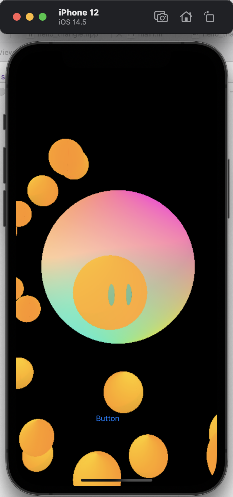
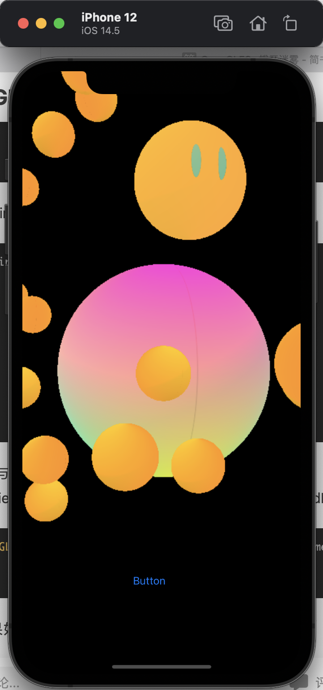
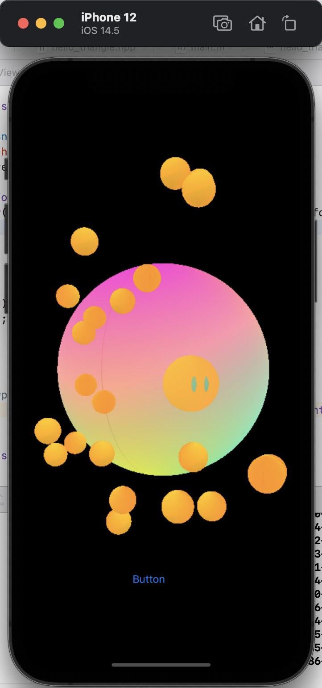
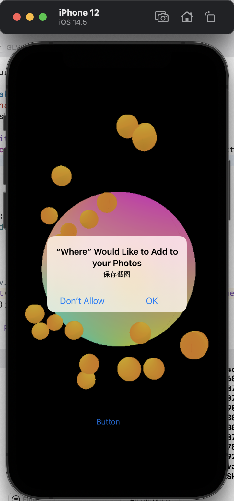
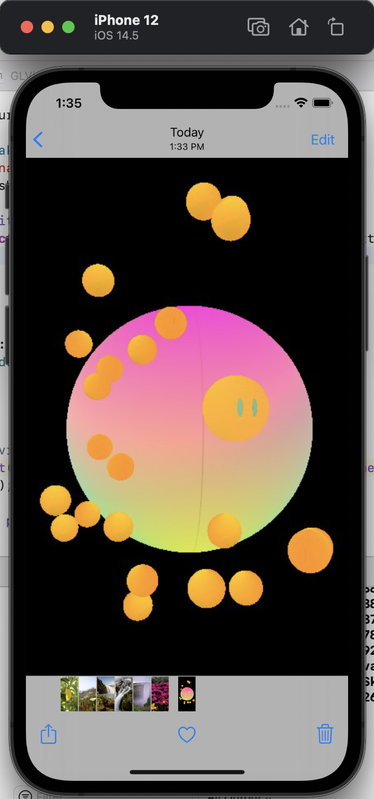

## iOS端设计

- OpenGL ES简介

  在iOS端，我们使用OpenGL ES进行渲染。OpenGL ES (OpenGL for Embedded Systems) 是 OpenGL 三维图形 API 的子集，针对手机、PDA和游戏主机等嵌入式设备而设计。OpenGL ES 是从 OpenGL 裁剪的定制而来的，去除了glBegin/glEnd，四边形（GL_QUADS）、多边形（GL_POLYGONS）等复杂图元等许多非绝对必要的特性。经过多年发展，现在有多个版本，在本项目中我们使用OpenGL ES 3.0。大部分特性与OpenGL 3.0类似。

- 设计思路
  在PC端的程序中，最顶层的对象是Application，程序通过调用Application对象的renderFrame、handleInput等方法渲染画面，处理输入。在iOS端，我们也考虑使用类似的架构，在视图（View）对象中定义Application成员变量，并调用Application对象中的函数进行画面渲染。本项目由objective-c和c++混合实现，视图对象需使用objective-c，Applicaiton类及该类中使用的对象可以使用c++编写。

- 迁移步骤：

  1. 定义自己的视图类型GLView，继承自UIView，在主视图的ViewController中写下如下代码创建GLView实例：

     ```objective-c
     @interface ViewController ()
     @property (nonatomic , strong) GLView* openGLView;
     @end
     
     @implementation ViewController
     
     - (void)viewDidLoad {
         [super viewDidLoad];
         self.openGLView = (GLView *)self.view;
     
     }
     
     - (void)didReceiveMemoryWarning {
         [super didReceiveMemoryWarning];
         // Dispose of any resources that can be recreated.
     }
     
     @end
     ```

  2. GLView类中定义需要的变量：

     ```objective-c
     @interface GLView ()
     {
         CAEAGLLayer *_eaglLayer;  //OpenGL内容只会在此类layer上描绘
         EAGLContext *_context;    //OpenGL渲染上下文
         GLuint _renderBuffer;     //
         GLuint _frameBuffer;      //
         GLuint _depthBuffer;      //深度缓存
     
         GLuint _programHandle;
         GLuint _positionSlot;
         
         GLuint _blendTextureID1;
         GLuint _blendTextureID2;
         GLuint _blendTextureID3;
         GLuint _blendTextureID4;
         GLuint _blendTextureID5;
         GLuint _blendTextureID6;
     
         //手势
         UIPanGestureRecognizer *_panGesture;      //平移
         UIPinchGestureRecognizer *_pinchGesture;  //缩放
         UIRotationGestureRecognizer *_rotationGesture; //旋转
         
         NSTimer* myTimer;
         
         Entity* app;
     }
     ```

     

  3. GLView中的渲染逻辑
     GLView中的layoutSubviews方法中展示了使用OpenES渲染的主要流程。

     ```objective-c
     - (void)layoutSubviews {
             _panGesture = [[UIPanGestureRecognizer alloc]initWithTarget:self action:@selector(viewTranslate:)];
             [self addGestureRecognizer:_panGesture];
     
             _pinchGesture = [[UIPinchGestureRecognizer alloc]initWithTarget:self action:@selector(viewZoom:)];
             [self addGestureRecognizer:_pinchGesture];
     
             _rotationGesture = [[UIRotationGestureRecognizer alloc]initWithTarget:self action:@selector(viewRotation:)];
             [self addGestureRecognizer:_rotationGesture];
             
             [self setupLayer];
             [self setupContext];
             
             [self setupDepthBuffer];
             [self setupRenderBuffer];
             [self setupFrameBuffer];
             [self setupApp];
             [self setupTimer];
     }
     ```

     一开始先设置了几个手势识别的对象，然后调用setupLayer和setupContext设置了OpenGL ES的上下文环境。接着setup...Buffer函数生成了程序运行需要的缓冲区，然后初始化了App，最后设置了一个Tiemr，使其每隔一段时间就调用一次render函数来渲染一帧的画面。

     render函数设计如下：

     ```objective-c
     -(void)render
     {
         // Setup viewport
         glViewport(0, 0, self.frame.size.width, self.frame.size.height);
         app->run();
         
         [_context presentRenderbuffer:_renderBuffer];
     }
     ```

     每次渲染会调用一次app中的run函数。

     到此完成了GLView中的渲染逻辑。

  4. 手势操作
     在layoutSubviews展示了如何设置手势识别对象，下面以平移为例展示如何处理动作。

     ```objective-c
     -(void)viewTranslate:(UIPanGestureRecognizer *)panGesture{
         NSLog(@"translate");
         CGPoint transPoint = [panGesture translationInView:self];
         float x = transPoint.x / self.frame.size.width;
         float y = transPoint.y / self.frame.size.height;
         app->move(glm::vec3(-x, y, 0.0f));
         
         [panGesture setTranslation:CGPointMake(0, 0) inView:self];
     }
     ```

     识别出手势能得到x和y方向的偏移量，调用app中的move函数即可移动摄像机，这与PC端中识别鼠标移动的过程类似，只不过由于手势识别必须用oc写，所以必须把这部分提到GLView层。

  5. 资源文件导入
     移动端的资源文件导入与PC端有较大的不同，由于移动端项目在运行时资源文件是存在于App程序目录下的，所以不能把资源文件的路径写死在程序中，而是要用如下的oc语句获取：

     ```objective-c
     NSString * nsFilepath = [[NSBundle mainBundle] pathForResource:@"sphere" ofType:@"obj"];
     const char* filepath = [nsFilepath UTF8String];
     ```

     由于并没有对应的c++代码可以获取这个文件路径，所以需要在app对象中保留设置文件路径的接口。

  6. 修改OpenGL框架
     修改框架中的代码（主要是base文件夹中的文件）使其向上兼容GLView，向下兼容PC端的代码。修改后的框架尽量达到PC端代码只做少量修改就可以用在移动端的效果。这里的修改部分较多且较杂，主要都是一些细节上的修改，不做详细的介绍，具体可参考源代码。

  7. 截图功能

     在移动端实现截图功能比较方便。

     获取屏幕画面的image对象的代码如下：

     ```objective-c
     - (UIImage*) takePicture {
         int s = 1;
         UIScreen* screen = [UIScreen mainScreen];
         if ([screen respondsToSelector:@selector(scale)]) {
             s = (int) [screen scale];
         }
     
         GLint viewport[4];
         glGetIntegerv(GL_VIEWPORT, viewport);
     
     
         int width = viewport[2];
         int height = viewport[3];
     
         int myDataLength = width * height * 4;
         GLubyte *buffer = (GLubyte *) malloc(myDataLength);
         GLubyte *buffer2 = (GLubyte *) malloc(myDataLength);
         glReadPixels(0, 0, width, height, GL_RGBA, GL_UNSIGNED_BYTE, buffer);
         for(int y1 = 0; y1 < height; y1++) {
             for(int x1 = 0; x1 <width * 4; x1++) {
                 buffer2[(height - 1 - y1) * width * 4 + x1] = buffer[y1 * 4 * width + x1];
             }
         }
         free(buffer);
     
         CGDataProviderRef provider = CGDataProviderCreateWithData(NULL, buffer2, myDataLength, NULL);
         int bitsPerComponent = 8;
         int bitsPerPixel = 32;
         int bytesPerRow = 4 * width;
         CGColorSpaceRef colorSpaceRef = CGColorSpaceCreateDeviceRGB();
         CGBitmapInfo bitmapInfo = kCGBitmapByteOrderDefault;
         CGColorRenderingIntent renderingIntent = kCGRenderingIntentDefault;
         CGImageRef imageRef = CGImageCreate(width, height, bitsPerComponent, bitsPerPixel, bytesPerRow, colorSpaceRef, bitmapInfo, provider, NULL, NO, renderingIntent);
         CGColorSpaceRelease(colorSpaceRef);
         CGDataProviderRelease(provider);
         UIImage *image = [ UIImage imageWithCGImage:imageRef scale:s orientation:UIImageOrientationUp ];
         return image;
     }
     ```

     首先在主视图中创建一个按钮，在按钮绑定如下函数：

     ```objective-c
     - (IBAction)takeSnapshot:(id)sender {
         NSLog(@"Snapshot");
         UIImage *shareImg = [self takePicture];
     
         UIImageWriteToSavedPhotosAlbum(shareImg,self, @selector(resultImage:didFinishSavingWithError:contextInfo:), NULL);
     }
     
     - (void)resultImage:(UIImage *)image didFinishSavingWithError:(NSError *)error
       contextInfo:(void *)contextInfo {
         NSLog(@"Snapshot Done");
     }
     ```

     即可完成截图功能，最后注意在项目的plist文件中加入获取相册权限的信息，否则程序会崩溃。

## iOS端效果演示

- 场景渲染

  

  如图为程序渲染的场景，这个场景中间有一个较大的彩色的球，球上的色彩会随时间的推移而变化。彩球周围悬浮着很多黄色小球，其中一个黄色小球上长着两只眼睛，绕着屏幕中心点做圆周运动。这个场景中涉及的渲染技术有体素渲染、模型的导入和渲染（大球）、贴图（眼睛）、混合纹理、坐标变换、基本光照等。

- 场景漫游

  为了适应移动端的交互方式，我们选择使用手势操作来作为场景漫游的输入，具体实现了两种手势的识别和响应，分别是

  1. 滑动：控制摄像机的左右上下移动。

  

  

​		2. 两指缩放：控制摄像机的前后移动。



- 截图功能
  因为移动端做截图比较方便，所以我们只在移动端实现了这个功能。
  点击“Button”按钮可以截取屏幕当前的画面，保存在相册中。
  第一次保存时系统会请求权限：



​		完成后可在系统相册中找到截取的图片：




由于迁移的版本为windows端中较早的版本，所以场景比较简陋，但已实现大部分最终版中需要的技术和交互模式，所以理论上可以把windows端的程序完全迁移到移动端。

